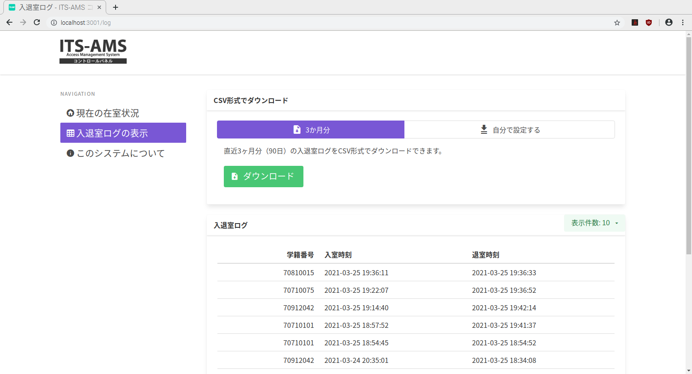

# クイックスタートガイド

この書面では本システムの機能と使い方の概要を紹介します。

## 1. 入退室ログの記録

研究室への出入り時、カードリーダーに本学の学生証や職員証をタッチすることで入室時刻または退室時刻がデータベースに記録されます。

### 学生側利用時の流れ

1. カードリーダーに学生証か職員証をタッチする。
2. 効果音に続いて挨拶の音声が流れる。

:warning: 交通系 IC カードや免許証などのカードをタッチすると警告音が鳴ります。本システムは本学の学生証または職員証にしか対応しておりませんので、必ずそれらを使用するようにしてください。

## 2. ユーザーインタフェース

本システムは入退室ログ等を閲覧するためのユーザーインタフェースを備えています。ブラウザを使用します。

### ユーザーインタフェースへのアクセス方法

- ラズベリーパイにディスプレイやキーボードを接続して使う場合
  1. ラズパイで画面左上の:earth_americas:マークをクリックしブラウザを起動します。
  2. `localhost:3001`にアクセスします。
- ラズベリーパイにディスプレイを接続せずに使う場合
  1. ラズベリーパイと同じネットワークに接続した任意の PC でブラウザを起動します。
     - ラズベリーパイを学内 LAN に接続した場合は PC も学内 LAN (WRL-SUCCES-S3) に接続します。
  2. `<ラズベリーパイの IP>:3001`にアクセスします。

---

### 現在の在室状況

アクセスするとこの画面になります。

現在、研究室にいる人の学籍番号がリアルタイムに確認できます。

---

### 入退室ログの表示

画面左の **[ 入退室ログの表示 ]** をクリックします。このような画面になります。

#### 入退室ログを CSV でダウンロード

画面上部では、現在までの入退室ログ(学籍番号、入室時間、退室時間)が CSV 形式でダウンロードできます。

左側のタブは直近 3 ヵ月分(三か月前からボタン押下時まで)ですが、 **[ 自分で設定する ]** ボタンを押して任意の期間を設定してのダウンロードもできます。

---

#### 全入退室ログを確認

入室時間の新しい順に並んでいますので、ここ数日の状況を確認したいときなどにご利用ください。

**[ 表示件数 ]** ボタンを押すことで一度に表示される件数を選択できます。表示できる件数は 5, 10, 15, 20 から選択可能です。

---

### このシステムについて

本システムのバージョン情報を表示します。
