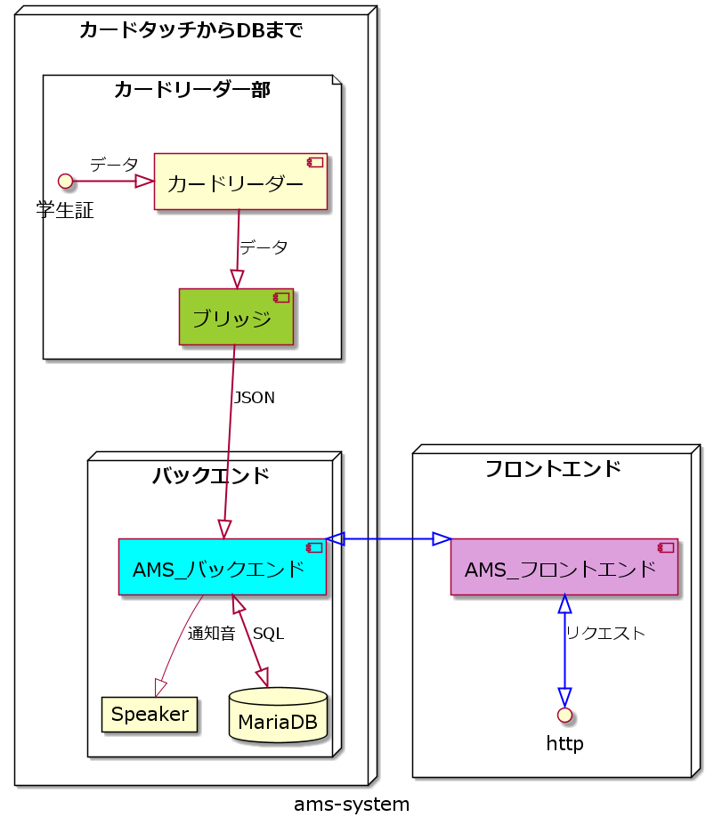

:icons: font

# ams-manual

## 本リポジトリの意義

本文書は 2021 年 4 月上旬段階で、ITS に存在する入退室管理ログシステム (通称: ams-system ) を外部の教授が使用するための取扱説明書、およびトラブルシューティングを

記載することを目的としたリポジトリです。

TIP: ITS 室員向けの資料ではないため、この資料を基に解析を始める等といった用途は企図していません。予めご注意ください。

---

### システムの概要図

基本的にシステムのデータの流れは左上から右に向かって流れていきます。

NOTE: 学生が関与するのはカードリーダにタッチする部分だけになります。

IMPORTANT: 逆に、直接DBにアクセスしたり等をしない場合、教授等の管理者サイドはフロントエンドを介してアクセスします。今回の取り扱い説明において、DBの設定等は記載しませんので、設定等をご自身でされる場合や、データの変更を行う場合、ITSとしては責任を負う事が出来ません。その際に発生した不具合等は一切感知しませんので、その点ご了承ください。

---

### システムの改良、改造、変更等について

潜在的な要望として、おそらくさまざまな追加の仕様変更をお願いしたい場合等があるとは思いますが、我々はシステム屋でもなければ、何でも屋さんでもないし、まして SIer でもありません。

WARNING: 本業の学業を疎かにしてまで、システム改修をすることは出来ませんので、仕様変更等については一切お受けしかねます。

ただし、本プログラムについては GitHub にてリポジトリを公開しており、また MIT ライセンスにしているため、改変等に関しては禁止しておりません。

CAUTION: MITライセンスの規約を守って頂けることを前提にしていますので、それは必ず守ってください。

---

### 確認事項

. DB 等への改造を施した場合、ITS では補償対象外になります。(リカバリ手順書に記載されている場合を除く)
. 仕様変更は一切対応しません。学業を疎かにして、所属もしてない研究室に尽くすほど、お人よしではありません。
. 本システムへの改修、改良は MIT ライセンスでの範囲内なら自由にしていただいてかまいませんが、ITS の補償から外れます。この点は必ずご了承ください。
. ITS(の本システムの開発メンバー)に瑕疵が存在するのは、ローンチしたモノが(電源コードが外れてしまったも異常動作に含みます)正常に動作しているにもかかわらず、意図しない動作をした場合に限ります。
. また、基本的には極めて緊急の場合を除き、遊橋先生経由で修復依頼はお願いします。
.. 緊急で対応しなければいけない場合のエスカレーションは、GitHub で issue テンプレートを用意しますので、それに従って記述してください。その際コミュニケーションロスがあると困るので、日本語でお願いします。
.. issue テンプレートはできるだけ詳細に、かつ、再現性のある書き方をお願いします。
. サポート期間は原則 1 年間です
.. 機器の故障はサポートしかねます
.. 装置を高温状態にして放置するなどの過失が我々にないような事象で壊れても対象外になります。

---

### システムで使用したフレームワーク、プログラミング言語等

不要だとは思いますが、もし自力で改修される場合、何を使ったのか、と言う話を聞きたいと思いますので、

記載はしておきますが、少しでも改修を加えた場合、補償は一切致しかねる事については前述の通りです。

---

#### バックエンド

. TypeScript (Node.js)
.. Express
. MariaDB

---

#### フロントエンド

. JavaScript (Node.js)
.. Nuxt.js (Vue.js のフレームワークです)

---

##### CI環境

. GitHub Actions
.. eslint (コードフォーマッタ)
.. Redpen (文書校正ツール)
.. TextLint (文書校正ツール)
... ReviewDog (PR 時にコメントに自動的に修正してほしい箇所を出力するプログラム)